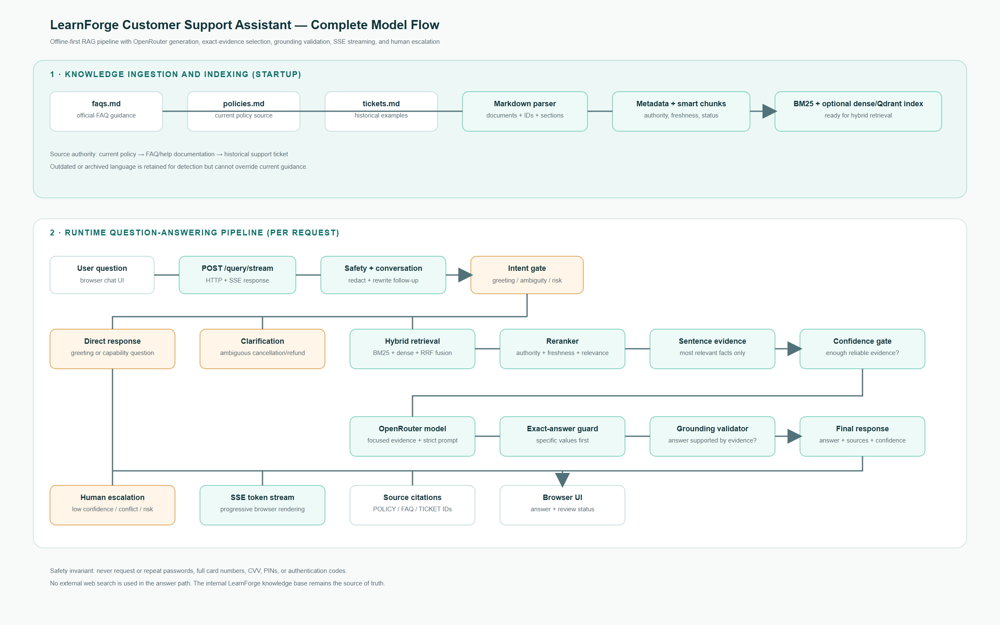

# LearnForge Customer Support Assistant

> **Production-style RAG prototype for grounded customer support**

LearnForge is an offline-first customer-support assistant built around the
provided FAQ, policy, and historical-ticket knowledge base. It combines
metadata-aware ingestion, hybrid retrieval, authority-aware reranking,
sentence-level evidence selection, optional OpenRouter generation, grounding
checks, safety redaction, escalation, conversation memory, and a streaming web
interface.

The default mode is deterministic and works without an API key. An
OpenAI-compatible provider can be enabled through environment variables; the
repository never contains a real secret.

## Assignment answer: how precision and reliability are achieved

This prototype does not send the entire knowledge base to the model and ask it
to summarize. It uses a controlled retrieval-and-generation loop:

1. **Relevant data is found with hybrid retrieval.** Each query is searched
   with BM25 lexical retrieval and an optional dense retriever. Their ranked
   lists are combined with Reciprocal Rank Fusion (RRF), so exact terms such as
   “refund period” and semantically similar wording can both be found.
2. **Relevance is calculated transparently.** BM25 scores term frequency,
   inverse document frequency, and document-length normalization. Retrieval
   also considers section-title matches. The reranker then combines the
   retrieval score with query-term overlap, source authority, freshness, and
   stale-content penalties. Current policies rank above FAQs, and FAQs rank
   above historical tickets.
3. **The evidence is narrowed before generation.** Retrieved chunks are split
   into sentences. Sentences matching the query are ranked again, with a
   boost for supported factual values such as numbers, dates, durations,
   percentages, and limits. Only the strongest evidence sentences are sent to
   the generator, which prevents an unrelated paragraph from dominating the
   answer.
4. **The answer is grounded and checked.** The model is instructed to answer
   from evidence, state an explicitly supported exact value first, and never
   invent missing values. The generated answer is checked for evidence overlap.
   If the provider is unavailable, deterministic grounded generation is used.
5. **Uncertainty is visible.** Missing evidence, low confidence, stale data,
   contradictions, unsafe requests, and failed grounding produce escalation
   metadata rather than a confident unsupported answer.

This design optimizes for **precision over broad recall in the final answer**:
retrieval may collect several candidates, but generation receives only the
highest-value, authoritative evidence. For example, the question “What is the
standard refund period?” selects the current policy sentence containing
“14 days” instead of leading with a general cancellation explanation.

### Direct answers to the review requirements

| Review question | Implementation answer |
|---|---|
| How is the most relevant text fetched? | BM25 plus optional dense retrieval, RRF fusion, authority/freshness reranking, then sentence-level evidence selection. |
| How is relevance measured? | BM25 term statistics, title/query overlap, RRF rank contribution, authority, freshness, stale penalties, and factual-value matching. |
| How is a precise answer produced? | Only focused evidence is passed to generation; exact supported values must lead the answer; grounding validation rejects unsupported output. |
| What happens with bad retrieval? | No-match and low-confidence results are disclosed and escalated instead of being presented as certain answers. |
| What happens with stale data? | Archived/outdated language is penalized and disclosed; current official policy takes precedence. |
| What happens when sources conflict? | The system does not select arbitrarily; it surfaces the conflict and follows escalation logic. |
| How is quality measured? | Recall@5 and MRR measure retrieval; answer correctness, grounded-claim rate, hallucination rate, exact-value accuracy, citation quality, escalation quality, latency, and cost measure production behavior. |
| How are records stored? | Documents and stable metadata-preserving chunks are represented as typed records; the same schema can be persisted in Qdrant, PostgreSQL, or another vector store. |
| How does the query flow end-to-end? | The complete flow is shown in the system diagram below and documented step by step in [Architecture and query flow](#architecture-and-query-flow). |

## Contents

- [Assignment answer: precision and reliability](#assignment-answer-how-precision-and-reliability-are-achieved)
- [Features](#features)
- [Quick start](#quick-start)
- [Using the application](#using-the-application)
- [OpenRouter configuration](#openrouter-configuration)
- [Using Gemini instead](#using-gemini-instead)
- [Architecture and query flow](#architecture-and-query-flow)
- [Data schema](#data-schema)
- [Failure handling and safety](#failure-handling-and-safety)
- [Evaluation plan](#evaluation-plan)
- [Trade-offs and next steps](#trade-offs-and-next-steps)
- [Repository layout](#repository-layout)
- [Security and deployment checklist](#security-and-deployment-checklist)

## Features

- Grounded answers from `faqs.md`, `policies.md`, and `tickets.md`.
- Current official policy and FAQ evidence outrank historical tickets.
- BM25 retrieval with optional dense/Qdrant adapters and reciprocal-rank fusion.
- Reranking using lexical relevance, authority, freshness, and stale-content
  signals.
- Focused sentence evidence so exact values such as durations, limits, dates,
  and percentages are not hidden by broad summaries.
- Optional OpenRouter generation with deterministic fallback.
- SSE streaming at `POST /query/stream`.
- Responsive browser UI with source, confidence, and escalation indicators.
- Conversation-aware follow-up rewriting.
- Redaction of passwords, full card numbers, CVV, PINs, and authentication
  codes before storage or generation.
- Human escalation for low confidence, contradictions, risk, and unsupported
  requests.

## Quick start

### Windows PowerShell

```powershell
cd E:\Mydata\Desktop\Customer_Support_Assistant
python -m venv .venv
.\.venv\Scripts\Activate.ps1
python -m pip install -r requirements.txt
```

Run an offline CLI question:

```powershell
python app.py --query "What is the standard refund period?"
python app.py --query "How do I watch courses offline?" --json
```

Run the tests and retrieval evaluation:

```powershell
python -m pytest -q
python evaluation\evaluate.py
```

Start the API and web interface:

```powershell
python app.py --serve --host 127.0.0.1 --port 8000
```

Open <http://127.0.0.1:8000/> in a browser.

Check that the service is ready:

```powershell
Invoke-RestMethod http://127.0.0.1:8000/health
```

Expected health response includes the loaded document and chunk counts:

```json
{"ok": true, "records": 40, "chunks": 40}
```

## Using the application

### JSON API

```powershell
$body = @{
  query = "What is the standard refund period?"
  conversation_id = "demo-user"
} | ConvertTo-Json

Invoke-RestMethod `
  http://127.0.0.1:8000/query `
  -Method Post `
  -ContentType "application/json" `
  -Body $body
```

`POST /query` returns an answer, source IDs, confidence, grounding status,
conversation ID, and optional escalation metadata.

### Streaming API

The browser uses `POST /query/stream`. It returns Server-Sent Events:

1. Multiple `token` events containing incremental answer text.
2. One `done` event containing the complete result and metadata.

This preserves the normal retrieval, safety, grounding, and escalation path;
only the final answer rendering is streamed to the client.

### Docker

```powershell
docker compose up --build
```

Then open <http://localhost:8000/>. Docker Compose reads provider settings from
the local `.env` file and does not require credentials for deterministic mode.

## OpenRouter configuration

OpenRouter is the current optional generation provider. The application uses
the OpenAI-compatible chat-completions API.

1. Create a local environment file. Do **not** edit the committed template:

   ```powershell
   Copy-Item .env.example .env
   ```

2. Open `.env` and set:

   ```dotenv
   SUPPORT_LLM_PROVIDER=openrouter
   SUPPORT_LLM_API_KEY=PASTE_YOUR_OPENROUTER_KEY_HERE
   SUPPORT_LLM_BASE_URL=https://openrouter.ai/api/v1/chat/completions
   SUPPORT_LLM_MODEL=openrouter/free
   ```

3. Start the application from the same terminal:

   ```powershell
   python app.py --serve --host 127.0.0.1 --port 8000
   ```

The `.env` file is ignored by Git. If the key is absent, invalid, or the
provider fails, the application falls back to its deterministic grounded
generator rather than returning an ungrounded answer.

## Using Gemini instead

The current code is provider-agnostic at the configuration boundary but
expects an OpenAI-compatible chat-completions endpoint. To use a Gemini model
through an OpenAI-compatible gateway, set the gateway URL, key, and model in
`.env`:

```dotenv
SUPPORT_LLM_PROVIDER=gemini
SUPPORT_LLM_API_KEY=YOUR_GEMINI_OR_GATEWAY_KEY
SUPPORT_LLM_BASE_URL=YOUR_OPENAI_COMPATIBLE_GEMINI_ENDPOINT
SUPPORT_LLM_MODEL=YOUR_GEMINI_MODEL_NAME
```

If calling the native Google Gemini API directly, the generation adapter must
be changed to its native request/response format; changing only the model name
is not sufficient. Retrieval, reranking, safety, grounding, streaming
contracts, and the knowledge base do not need to be redesigned.

## Architecture and query flow



Editable source: [docs/learnforge-model-flow.svg](docs/learnforge-model-flow.svg).

### Startup ingestion

1. Load Markdown records from `faqs.md`, `policies.md`, and `tickets.md`.
2. Parse document IDs, titles, sections, authority, review dates, and status.
3. Create metadata-preserving chunks with stable IDs.
4. Build the always-available BM25 index.
5. Optionally initialize dense retrieval/Qdrant integrations.

### Per-request flow

1. Receive a question from the CLI, JSON API, or browser.
2. Redact sensitive payment/authentication data.
3. Rewrite short follow-ups using bounded conversation memory.
4. Handle greetings, capability questions, and ambiguous cancellation directly.
5. Retrieve candidates with hybrid lexical/dense search and RRF.
6. Rerank by relevance, source authority, freshness, and stale-language
   penalties.
7. Select the most relevant sentences rather than passing unrelated chunks.
8. Compute confidence and detect missing or conflicting evidence.
9. Generate a concise answer with exact supported values first.
10. Validate answer grounding against retrieved evidence.
11. Escalate low-confidence, risky, contradictory, or unsupported cases.
12. Return citations and metadata; the stream endpoint emits the answer tokens
    progressively to the browser.

## Data schema

The in-memory schema is intentionally suitable for a vector database record,
SQL table, or document store.

### Document

| Field | Description |
|---|---|
| `id` | Stable source document ID, such as `POLICY-02` |
| `title` | Human-readable title |
| `kind` | `faq`, `policy`, or `ticket` |
| `source_file` | Original Markdown file |
| `text` | Full source document text |
| `authority` | Source priority used during reranking |
| `review_date` | Freshness/review metadata |
| `status` | Current, archived, or historical |
| `metadata` | Additional source attributes |

### Chunk / retrieval record

| Field | Description |
|---|---|
| `id` | Stable ID in the form `document_id:ordinal` |
| `document_id` | Parent document ID |
| `section` | Markdown section heading |
| `text` | Searchable chunk text |
| `authority` | Inherited source authority |
| `review_date` | Inherited freshness metadata |
| `status` | Inherited current/archived status |
| `embedding` | Optional dense vector in a production vector store |
| `lexical_score` | BM25 score, calculated at query time |
| `rerank_score` | Combined relevance/authority/freshness score |

The current prototype keeps records in memory for reproducibility. A
production implementation can persist the same fields in Qdrant, PostgreSQL
with vector extensions, or another managed vector store without changing the
answer contract.

## Failure handling and safety

| Failure | Handling |
|---|---|
| No matching retrieval | Return an uncertainty response and create escalation metadata |
| Low confidence | Do not claim certainty; escalate for human review |
| Broad or stale evidence | Prefer current policy/FAQ; disclose stale material |
| Conflicting sources | Do not choose arbitrarily; surface the conflict and escalate |
| Failed grounding | Mark the response ungrounded and escalate |
| Ambiguous cancellation/refund | Ask a clarification question instead of guessing |
| Payment/security risk | Redact sensitive content and escalate with safe fields only |
| LLM timeout/invalid response | Fall back to deterministic grounded generation |
| Missing API key | Run normally in offline deterministic mode |

The assistant never asks users to provide passwords, full card numbers, CVV,
PINs, or authentication codes. It does not authenticate users or execute
billing/account actions.

## Evaluation plan

Run the included offline evaluation:

```powershell
python evaluation\evaluate.py
```

The labelled dataset currently measures:

- **Recall@5**: whether a relevant source appears in the top five results.
- **MRR**: how high the first relevant result is ranked.
- Query coverage and regression behavior through `pytest`.

For company-grade evaluation, extend the dataset with representative and
adversarial questions and measure:

1. **Answer correctness**: human or rubric-based judgment against the policy.
2. **Grounded claim rate**: percentage of answer claims supported by cited
   evidence.
3. **Hallucination rate**: unsupported factual claims divided by all factual
   claims.
4. **Exact-value accuracy**: numbers, dates, durations, limits, and percentages
   copied correctly from authoritative evidence.
5. **Citation precision/recall**: whether cited sources support the answer and
   whether all necessary sources were cited.
6. **Escalation precision/recall**: whether uncertain/risky cases are escalated
   without over-escalating routine questions.
7. **Stale-policy resistance**: current guidance must beat archived tickets.
8. **Operational metrics**: latency, token usage, provider errors, and cost.

Every production change should run the regression suite and a fixed golden
question set covering normal, ambiguous, conflicting, stale, and safety-risk
requests.

## Trade-offs and next steps

### Why this design

- **BM25 first**: transparent, deterministic, offline, and dependency-light
  for a take-home prototype.
- **Hybrid retrieval boundary**: leaves room for embeddings and Qdrant when
  semantic recall is more important than zero-setup reproducibility.
- **Authority-aware reranking**: prevents a plausible historical ticket from
  silently overriding current policy.
- **Focused evidence**: improves exact-answer behavior without replacing the
  existing retriever or streaming contract.
- **Deterministic fallback**: keeps demos and tests reliable when an LLM
  provider is unavailable.
- **SSE rather than WebSockets**: sufficient for one-way token streaming and
  simpler to operate.

### With more time or budget

- Persist embeddings and indexes in a managed vector database.
- Add a cross-encoder reranker and benchmark it against BM25/RRF.
- Add effective-date filtering and an automated policy publishing workflow.
- Add authenticated users and durable conversation storage.
- Add structured tracing, prompt/version monitoring, rate limits, and cost
  budgets.
- Add a human-reviewed answer benchmark and continuous hallucination tests.
- Deploy behind HTTPS, a reverse proxy, and a secret manager.

## Repository layout

```text
.
├── app.py                         # Compatibility CLI/API entry point
├── app/
│   ├── main.py                    # Application composition and orchestration
│   ├── api/routes.py              # Health, JSON, SSE, and static UI routes
│   ├── ingestion/                 # Markdown loading and chunking
│   ├── retrieval/                 # Hybrid retrieval and reranking
│   ├── generation/                # Prompting and optional OpenRouter adapter
│   ├── conversation/              # Memory, rewrite, and redaction
│   ├── safety/                    # Confidence and grounding checks
│   └── schemas/                   # Typed document/chunk/response models
├── frontend/                      # Browser chat interface
├── evaluation/                    # Labelled retrieval evaluation
├── tests/                         # Regression tests
├── docs/                          # PNG and editable SVG system diagram
├── faqs.md                        # FAQ knowledge source
├── policies.md                    # Current policy knowledge source
├── tickets.md                     # Historical support examples
├── .env.example                   # Safe configuration template
├── Dockerfile
└── docker-compose.yml
```

## Security and deployment checklist

- Keep `.env` out of Git; commit only `.env.example`.
- Use a deployment secret manager or CI/CD secret for `SUPPORT_LLM_API_KEY`.
- Rotate/revoke any key that was pasted into chat, email, a document, or a
  public repository.
- Deploy the API behind HTTPS and authentication before handling real users.
- Add rate limiting and request logging with sensitive values redacted.
- Review the knowledge base whenever policy changes; mark old material
  archived instead of deleting its provenance.
- Run `python -m pytest -q` before publishing changes.

## License / assignment note

This repository is a demonstration and take-home assignment prototype. It
does not provide production authentication, billing execution, or legal advice.
